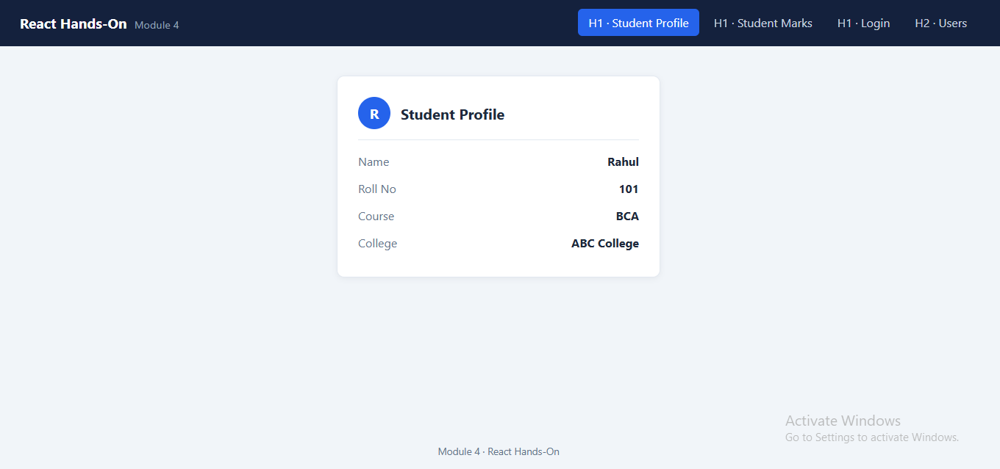
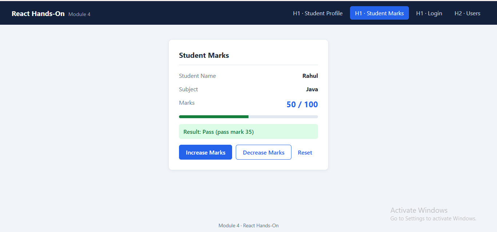
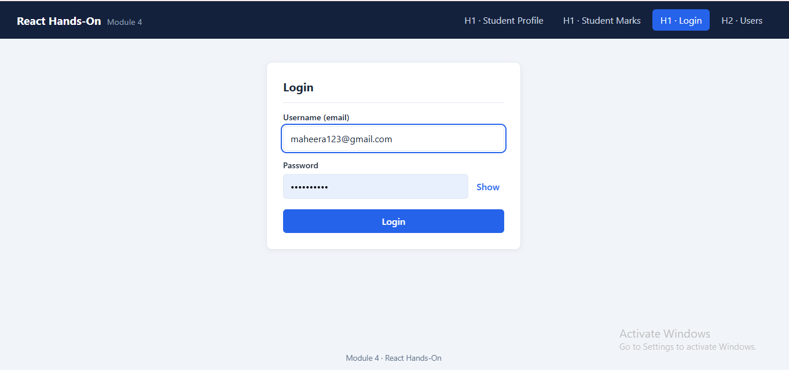
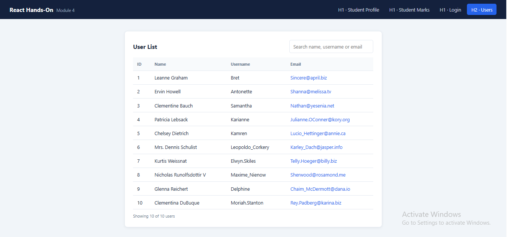

# Module 4 – React Hands-On

A single React (Vite) application that contains all Module 4 hands-on exercises behind one common navigation bar.

## Tech stack
React 18 · Vite · plain CSS · `prop-types`

## Run locally
```bash
npm install
npm run dev
```
Open the URL shown in the terminal (usually http://localhost:5173).
Production build: `npm run build`.

## Project structure
```
module4/
├── index.html
├── package.json
├── screenshots/                 output screenshots for each exercise
└── src/
    ├── main.jsx                 app entry
    ├── App.jsx                  page switching (common interface)
    ├── App.css                  all styles
    ├── components/
    │   └── Navbar.jsx           shared navigation bar
    ├── pages/
    │   ├── HandsOn1/
    │   │   ├── Student.jsx      1. Student Profile      (props)
    │   │   ├── StudentMarks.jsx 2. Student Marks        (props + state)
    │   │   └── LoginForm.jsx    3. Login Form           (state)
    │   └── HandsOn2/
    │       └── Users.jsx        User List               (useEffect + fetch)
    └── utils/
        └── validators.js        shared email / password rules
```

---

## Requirements

### Hands-On 1.1 – Student Profile (props)
| ID | Requirement |
|---|---|
| R1.1 | `Student.jsx` is reusable and receives `name`, `rollNo`, `course`, `college` through props. |
| R1.2 | Details are displayed inside a card titled "Student Profile". |
| R1.3 | All four props are required and type-checked with PropTypes. |
| R1.4 | The card shows an avatar with the first letter of the student's name. |

### Hands-On 1.2 – Student Marks (props + state)
| ID | Requirement |
|---|---|
| R2.1 | `name` and `subject` come from props; `marks` is stored in state (initial value 50). |
| R2.2 | "Increase Marks" adds 1 and "Decrease Marks" subtracts 1. |
| R2.3 | Marks must stay between 0 and 100; the matching button is disabled at the limit and a hint is shown. |
| R2.4 | A progress bar and a Pass/Fail result (pass mark 35) update with the marks. |
| R2.5 | A "Reset" button returns marks to 50. |

### Hands-On 1.3 – Login Form (state)
| ID | Requirement |
|---|---|
| R3.1 | Username and password are stored with `useState`. |
| R3.2 | If either field is empty, show **"Please enter username and password"**. |
| R3.3 | If both are filled and valid, show **"Login Successful"**. |
| R3.4 | The username must be a valid email format (`name@example.com`); otherwise show a field error. |
| R3.5 | The password must be at least 6 characters; otherwise show a field error. |
| R3.6 | Show/Hide password toggle; pressing Enter submits the form. |

### Hands-On 2 – User List (`useEffect` + `fetch`)
| ID | Requirement |
|---|---|
| R4.1 | Users are stored with `useState` and fetched inside `useEffect` using `fetch()` from `https://jsonplaceholder.typicode.com/users`. |
| R4.2 | Show **"Loading..."** while the request is in progress. |
| R4.3 | Show an error message (with a "Try again" button) if the request fails or the server returns a non-OK status. |
| R4.4 | Display ID, Name, Username and Email in a table. |
| R4.5 | Emails are checked against the email format: valid emails are clickable `mailto:` links; invalid ones are flagged in red. |
| R4.6 | A search box filters by name, username or email, shows "No users match" when empty, and a "Showing X of Y" count. |
| R4.7 | The request is cancelled (`AbortController`) if the user leaves the page. |

---

## Test cases

| Exercise | Action | Expected result |
|---|---|---|
| Profile | Open tab | Card shows Rahul, 101, BCA, ABC College |
| Marks | Click Increase once | Marks 51 |
| Marks | Click Increase until 100 | Increase button disabled |
| Marks | Decrease below 35 | Result changes to Fail |
| Login | Click Login with empty fields | "Please enter username and password" |
| Login | `rahul` + `123456` | Error: enter a valid email |
| Login | `rahul@gmail.com` + `123` | Error: password at least 6 characters |
| Login | `rahul@gmail.com` + `123456` | "Login Successful" |
| Users | Open tab | "Loading..." then 10 users |
| Users | Go offline, reopen tab | Error message with "Try again" |
| Users | Type `ervin` in search | Only Ervin Howell is shown |

---

## Screenshots

### Student Profile


### Student Marks


### Login Form


### User List
